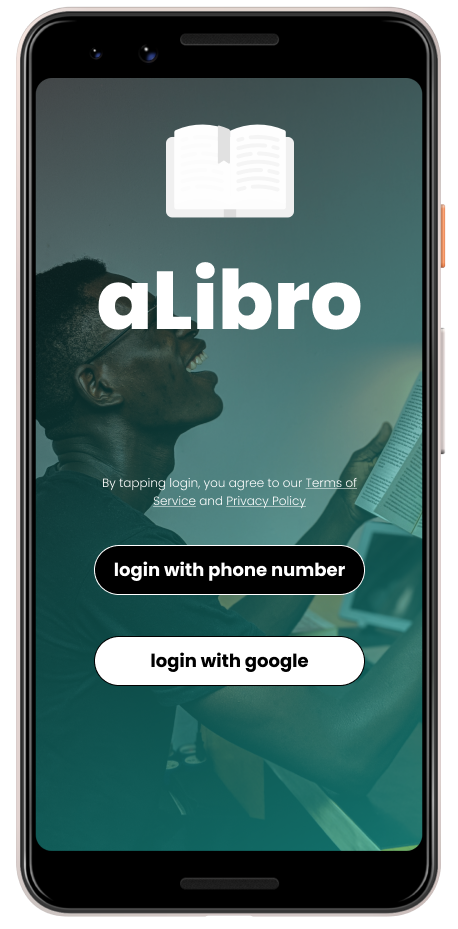
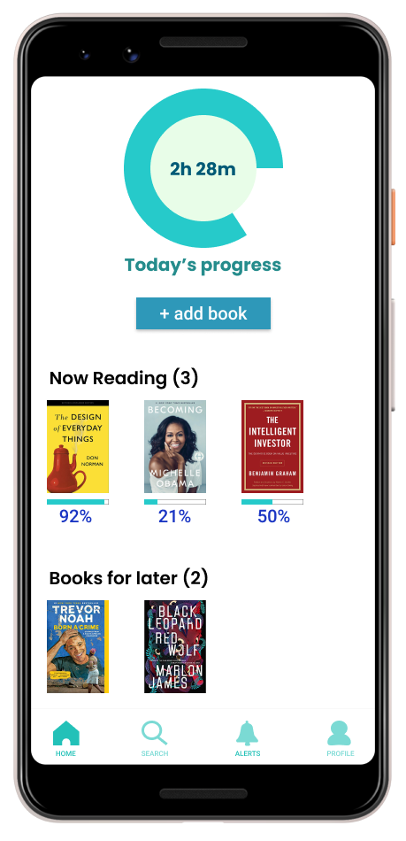

# aLibro
---

Physical books still outsell e-books. aLibro project designed to help readers who hold on to their physical books to keep track of their reading goals.

## Usage

`npm install`

Install dependences required for the app to run.

`npm start`

Calls react-native run-android to run on android device.

## Screens
1                          |  2
:-------------------------:|:-------------------------:
 |  

3                          |  4
:-------------------------:|:-------------------------:
...in development             | ...in development
